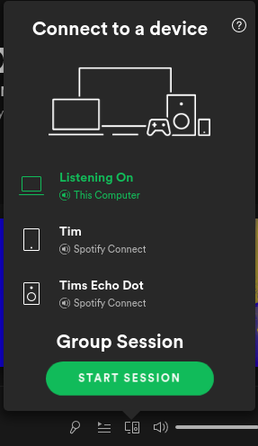

# spotify-group-session
Brings Spotify Group Sessions to the desktop client.

## Installation
1. Install [Spicetify](https://github.com/khanhas/spicetify-cli)
2. Run `spicetify config extensions /path/to/group-session.js`
3. Run `spicetify backup apply`

## Features/ToDo

- [x] Start Session
- [x] Close Session
- [x] Show Spotify Code (used to join via scan)
- [ ] Allow copying invite link
- [ ] Option: Show Spotify Code in fullscreen mode
- [ ] See/Kick listeners

