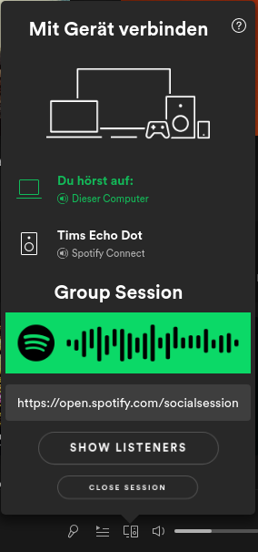
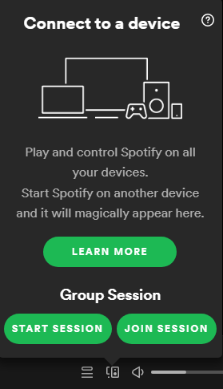
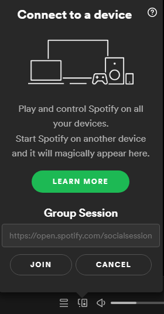

# spotify-group-session
Brings Spotify Group Sessions to the desktop client. 

**Important:** Requires Spotify Premium.

  
   
  

## Installation
1. Install [Spicetify](https://github.com/khanhas/spicetify-cli)
2. Download [group-session.js](https://github.com/timll/spotify-group-session/blob/main/src/group-session.js) and save it to Spicetify's `Extension` folder (`spicetify config-dir` will open the Spicetify folder for you).
3. Run `spicetify config extensions group-session.js`
4. Run `spicetify backup apply`

## Features

- [x] Start Session
- [x] Join Session
- [x] Close/Leave Session
- [x] Show Spotify Code (used to join via scan)
- [x] Allow copying invite link (click on the field)
- [x] Option: Show Spotify Code in fullscreen mode
- [x] See listeners

## Usage
The extension is enabled by default. You'll find the group session in the device menu, just as on mobile.
Additionally, there is a menu in the top right corner accessible by clicking on your name. There you can enable/disable the extension and toggle the option to show the spotify code also in full screen. 